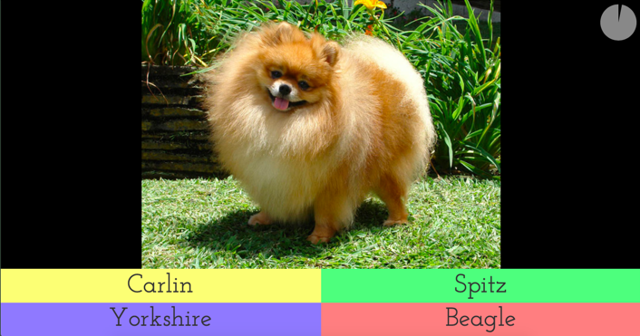

## QUIZZ

Quizz is a [kahoot](https://kahoot.com)-like game.

The organizer shows a series of questions at the screen,
and the players choose the answer on their smartphone,
amongst four possibilities.

  


Between each question, the score of all the players is shown.

## INSTALLATION

Run `npm install` from the directory to install the 
dependencies (so far only express and ws are required).

By default the server listens to port 8000. This can be changed 
in `server.js` (version with websockets) or `server2.js`
(version withou websockets).

The interface is currently in french. The file `static/i18n.js`
can be customized and adapted to your language.

## GAME PREPARATION

Currently, the archive comes with a short game named `demo`
with 20 questions in french. 

You can either modify the server to permanently include other games,  
or have a local zip file on your desktop to be used temporarily (see below).

### ON THE SERVER

To create a game named `mygame` for example :
* create a subdirectory `mygame` in the directory `static`
* put the pictures of all the questions in this subdirectory
* modify the file `static/games.json` to contain the list of games :
```
	[
		{"name":"mygame",
		"questions":[
			{
			img:"picture1.jpg",
			choices:["choice1of1","choice2of1","choice3of1","choice4of1"],
			answer:2	
			},
			{
			img:"picture2.jpg",
			choices:["choice1of2","choice2of2","choice3of2","choice4of2"],
			answer:4
			},
			...
			]
		}
		,
		{
		"name":"anothergame",
	...
		}
	]
```

### ON THE DESKTOP

If you are not able/willing to change the server, you can create 
on your desktop a zip archive containing the file `games.json`  and
the directories of the various games.  

This zip file can be created manually or with the `builder` tool (see below).

## USAGE

The main display and the smartphones must have access to the server. 
For example they can be on the same wifi network.  
But you can also use [ngrok](https://ngrok.com) to expose the server at a public address.

* Run the server :
```
node server.js		( version with websockets )
```
or
```
node server2.js		( version without websockets 
```


* In the desktop browser open the main page :
```
http://myaddress:8000
```
The url to be used by the smartphones is displayed in the header.  
It is the main url followed by a unique three-letter identifier,
in order to allow multiple simultaneous games.

If you move the mouse over this header, the corresponding qrcode is displayed,
to make smartphone connections easer.

* On each smarphone open the page
```
http://myaddress:8000/xyz  ( as displayed on the desktop )
```

* Wait for each player to be connected

* Click OK

* Choose the game to be played in the menu, or drop the zip file
prepared in the above step.

## TRY ONLINE

You can try the demo : [here](http://lerallyemobile.fr:8000)

## BUILDER

The local zip file can be created in the browser with the builder utility:
```
http://myaddress:8000/builder.html
```
* Change the name of the game by clicking on the title and typing the new name.

* To add a question, drop a picture on the right side, and supply four different choices
on the left side, the correct answer being the first one. Then click the left arrow button. A thumbnail of the picture is added to the gallery.

* To modify a question, click on the thumbnail in the gallery, modify the choices, then click the left arrow button.

* To remove a question, click on the thumbnail in the gallery, then click on the cross button.

* To scroll the gallery, use the left and right arrow from the keyboard.

* To download the zip archive, click the down arrow button.

You can try the builder online [here](http://lerallyemobile.fr:8000/builder.html)

## ACKNOWLEDGEMENT

When a local zip file in dropped onto the interface, the file in
uncompressed with the help of the [zip.js](https://github.com/gildas-lormeau/zip.js) library by Gildas Lormeau. The builder generates a zip file with this same utility.

The initial QRCode is displayed with David Shim's [QRCode.js](https://davidshimjs.github.io/qrcodejs/)
	
